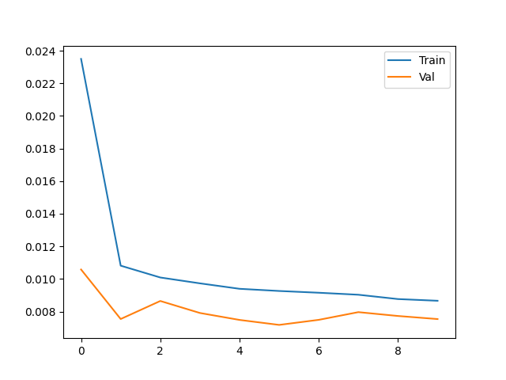

<div align="center">

# ⚡ Smart Home Energy Management Dashboard

### AI-Powered Energy Optimization with Neural Networks & Fuzzy Logic

<br>

[](https://python.org)
[](https://tensorflow.org)
[](https://streamlit.io)
[](https://plotly.com)
[](LICENSE)

<br>

> A complete end-to-end smart energy system that **predicts**, **optimizes**, and **controls** home energy usage in real time — combining the power of deep learning and fuzzy logic.

<br>



</div>

---

## 📌 Table of Contents

- [Overview](#-overview)
- [Features](#-features)
- [System Architecture](#-system-architecture)
- [Project Structure](#-project-structure)
- [AI Models](#-ai-models)
- [Fuzzy Logic Engine](#-fuzzy-logic-engine)
- [Dashboard Tabs](#-dashboard-tabs)
- [Installation](#-installation)
- [Usage](#-usage)
- [Results](#-results)
- [Technologies](#-technologies)
- [Author](#-author)

---

## 🔍 Overview

This project is a full **AI Lab project** that simulates a real-world smart home energy management system. It integrates three intelligent components working together:

- 🧠 **LSTM Neural Networks** — forecast energy consumption and solar panel output
- 🔀 **Fuzzy Logic Controller** — make intelligent real-time decisions
- 📊 **Interactive Streamlit Dashboard** — visualize and control everything live

The system continuously analyzes energy demand, solar generation, battery levels, and grid prices to make optimal decisions — reducing costs and maximizing renewable energy usage.

---

## ✨ Features

| # | Feature | Description |
|---|---------|-------------|
| 1 | 🔮 **Consumption Prediction** | LSTM predicts next-hour energy usage from 24h of history |
| 2 | ☀️ **Solar Forecast** | LSTM predicts solar output from 7 days (168h) of history |
| 3 | 🤖 **Fuzzy Decision Engine** | 21 rules controlling appliances, battery & grid in real time |
| 4 | 📊 **4-Tab Dashboard** | Overview, Predictions, AI Decisions, Analytics |
| 5 | 🔄 **Real-Time Simulation** | One-click randomized data simulation |
| 6 | 🎛️ **Interactive Controls** | Live sliders for all input parameters |
| 7 | ⚡ **Energy Flow Diagram** | Sankey chart showing real-time energy routing |
| 8 | 🔋 **Battery Gauge** | Live battery level visualization |
| 9 | 📁 **Data Generator** | Generates a full year (8,760 hours) of realistic training data |

---

## 🏗️ System Architecture

```
┌─────────────────────────────────────────────────────────────────┐
│                   SMART HOME ENERGY SYSTEM                      │
│                                                                 │
│   ┌─────────────────────┐    ┌─────────────────────┐           │
│   │   LSTM Model        │    │   LSTM Model        │           │
│   │   Consumption       │    │   Solar Generation  │           │
│   │   (24h window)      │    │   (168h window)     │           │
│   └──────────┬──────────┘    └──────────┬──────────┘           │
│              │                          │                       │
│              └──────────┬───────────────┘                       │
│                         ▼                                       │
│              ┌─────────────────────┐                            │
│              │   Fuzzy Logic       │  ← Battery Level           │
│              │   Decision Engine   │  ← Grid Price              │
│              │   (21 Rules)        │  ← Time of Day             │
│              └──────────┬──────────┘                            │
│                         │                                       │
│          ┌──────────────┼──────────────┐                        │
│          ▼              ▼              ▼                        │
│    🏠 Appliance    🔋 Battery      ⚡ Grid                      │
│      Reduction       Action       Interaction                   │
│    (0 – 100%)    (Charge/Hold/   (Buy/Sell/                     │
│                   Discharge)      Neutral)                      │
│                                                                 │
│              ┌─────────────────────┐                            │
│              │  Streamlit          │                            │
│              │  Dashboard          │                            │
│              │  (4 Tabs + Sidebar) │                            │
│              └─────────────────────┘                            │
└─────────────────────────────────────────────────────────────────┘
```

---

## 📁 Project Structure

```
Smart-Home-energy-consumption/
│
├── 📊 dashboard.py              # Main Streamlit dashboard (4 tabs)
│
├── 🧠 consumption_model.py      # LSTM model — energy consumption
├── ☀️  solar_model.py            # LSTM model — solar generation
├── 🔀 fuzzy_system.py           # Fuzzy logic controller (21 rules)
├── 📂 data_generation.py        # Synthetic dataset generator
│
├── 💾 consumption_model.h5      # Pre-trained consumption model
├── 💾 solar_model.h5            # Pre-trained solar model
│
├── 📈 consumption_data.csv      # 8,760 rows — hourly consumption data
├── 📈 solar_data.csv            # 8,760 rows — hourly solar data
│
├── 📉 consumption_accuracy.png  # Training/validation loss curves
├── 📉 solar_accuracy.png        # Training/validation loss curves
│
├── 📖 README.md                 # This file
└── ▶️  START_DASHBOARD.bat       # One-click launcher (Windows)
```

---

## 🧠 AI Models

### Model 1 — Energy Consumption LSTM

| Parameter | Value |
|-----------|-------|
| Input window | 24 hours |
| Input features | 9 |
| Architecture | LSTM(50) → Dropout(0.2) → LSTM(50) → Dropout(0.2) → Dense(1) |
| Optimizer | Adam |
| Loss function | MSE |
| Train / Val / Test | 70% / 15% / 15% |
| Output | Next-hour consumption (kWh) |

**Features:** `consumption`, `temperature`, `hour`, `day_of_week`, `month`, `occupancy`, `weather`, `previous_day_cons`, `weekend`

---

### Model 2 — Solar Generation LSTM

| Parameter | Value |
|-----------|-------|
| Input window | 168 hours (7 days) |
| Input features | 9 |
| Architecture | LSTM(50) → Dropout(0.2) → LSTM(50) → Dropout(0.2) → Dense(1, relu) |
| Optimizer | Adam |
| Loss function | MSE |
| Train / Val / Test | 70% / 15% / 15% |
| Output | Next-hour solar generation (kWh) |

**Features:** `solar_gen`, `temperature`, `humidity`, `pressure`, `hour`, `month`, `cloud_cover`, `irradiance`, `panel_efficiency`

---

## 🔀 Fuzzy Logic Engine

The fuzzy controller takes **5 inputs** and produces **3 outputs** using **21 expert rules**.

### Inputs

| Variable | Range | Linguistic Terms |
|----------|-------|-----------------|
| `energy_demand` | 0 – 100 | Low · Medium · High |
| `solar_gen` | 0 – 100 | Poor · Moderate · Excellent |
| `battery_level` | 0 – 100 | Critical · Low · Medium · High |
| `grid_price` | 0 – 100 | Cheap · Normal · Expensive |
| `time_of_day` | 0 – 24 | Night · Morning · Afternoon · Evening |

### Outputs

| Variable | Range | Linguistic Terms |
|----------|-------|-----------------|
| `appliance_reduction` | 0 – 100% | None · Slight · Moderate · Aggressive |
| `battery_action` | -100 to +100 | Discharge · Maintain · Charge |
| `grid_interaction` | -100 to +100 | Buy · Neutral · Sell |

### Rule Categories (21 total)

```
🔴  Peak Demand Management  →  4 rules
🟡  Solar Optimization      →  3 rules
🔵  Battery Management      →  3 rules
⚡  Grid Decisions           →  2 rules
🚨  Emergency Scenarios      →  2 rules
🟢  General Variations       →  7 rules
```

**Example Rule:**
> IF `energy_demand = HIGH` AND `solar_gen = POOR` AND `battery = CRITICAL` AND `grid_price = EXPENSIVE` AND `time = EVENING`
> → THEN `appliance_reduction = AGGRESSIVE`, `battery = MAINTAIN`, `grid = BUY`

---

## 📱 Dashboard Tabs

| Tab | Content |
|-----|---------|
| `📊 Overview` | 4 KPI metrics · Energy Flow Sankey chart · Battery gauge |
| `🔮 Predictions` | LSTM forecast charts for consumption & solar output |
| `🧠 AI Decisions` | Fuzzy logic output gauges & smart recommendations |
| `📈 Analytics` | Historical trends · Pattern analysis · Statistics |

**Sidebar Controls:**
- 🔄 One-click real-time data simulation button
- 🎛️ 5 interactive sliders: demand · solar · battery · price · time

---

## ⚙️ Installation

### Requirements
- Python 3.10+
- pip

### Step-by-step

```bash
# 1. Clone the repository
git clone https://github.com/Chiheb0156/Smart-Home-energy-consumption.git
cd Smart-Home-energy-consumption

# 2. Install all dependencies
pip install streamlit pandas numpy tensorflow plotly scikit-fuzzy scikit-learn matplotlib

# 3. (Optional) Regenerate training data from scratch
python data_generation.py

# 4. (Optional) Retrain the models
python consumption_model.py
python solar_model.py
```

> ✅ **Pre-trained models are already included** — skip steps 3 & 4 and go straight to the dashboard.

---

## 🚀 Usage

### Option A — Windows (Easiest)
Double-click **`START_DASHBOARD.bat`** ▶️

### Option B — Terminal (Any OS)
```bash
streamlit run dashboard.py
```

Then open your browser at: **http://localhost:8501**

---

## 📉 Results

Both LSTM models converge well within 10 epochs with no significant overfitting:

| Model | Final Train Loss | Final Val Loss | Status |
|-------|-----------------|----------------|--------|
| Consumption LSTM | ~0.009 | ~0.008 | ✅ Converged |
| Solar LSTM | ~0.007 | ~0.008 | ✅ Converged |

Validation loss tracks closely with training loss, confirming the models generalize well to unseen data.

---

## 🛠️ Technologies

<div align="center">

| Technology | Purpose |
|-----------|---------|
| 🐍 Python 3.10+ | Core language |
| 🧠 TensorFlow / Keras | LSTM model training & inference |
| 📊 Streamlit | Interactive web dashboard |
| 📈 Plotly | Charts, Sankey diagrams, gauges |
| 🔀 scikit-fuzzy | Fuzzy logic control system |
| ⚙️ scikit-learn | Data preprocessing & train/val/test split |
| 🐼 Pandas | Data manipulation |
| 🔢 NumPy | Numerical computing |

</div>

---

## 👤 Author

<div align="center">

**Chiheb**
🎓 AI Lab Project — Smart Home Energy Management

[](https://github.com/Chiheb-bt)

</div>

---

<div align="center">

⭐ **If you found this project useful, please give it a star!** ⭐

*Built with ❤️ using Python, TensorFlow & Streamlit*

</div>
